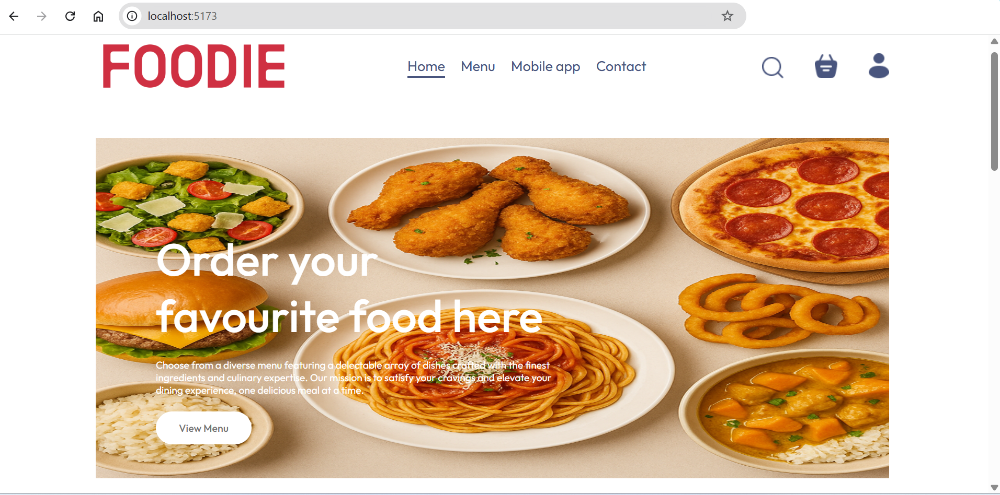
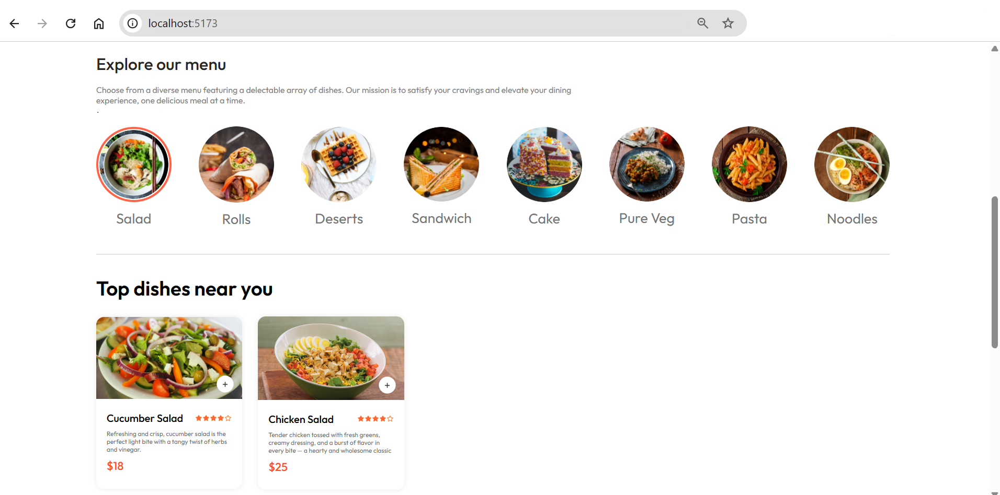
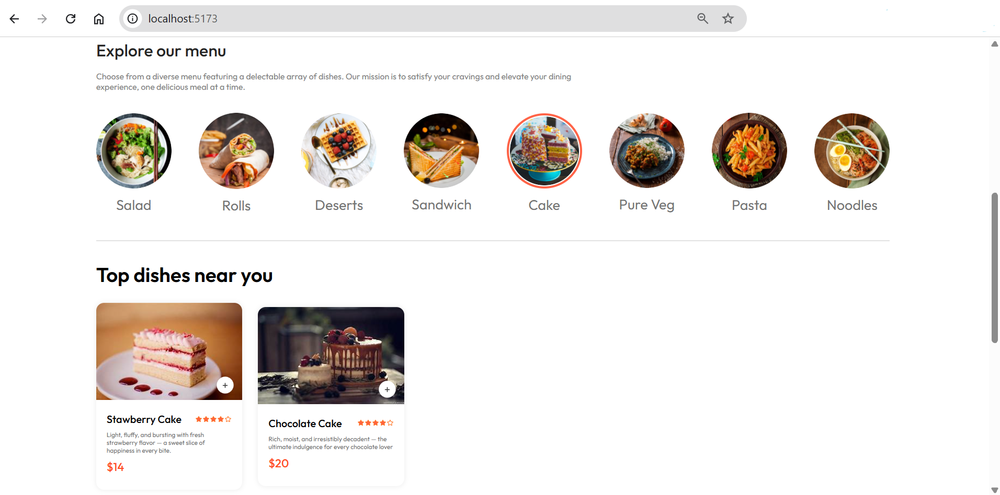
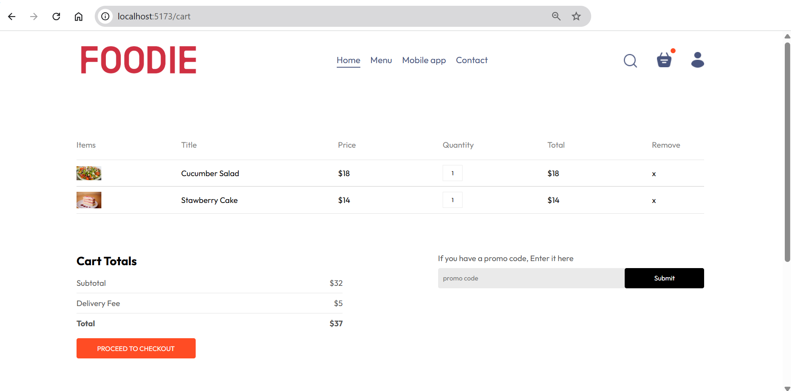
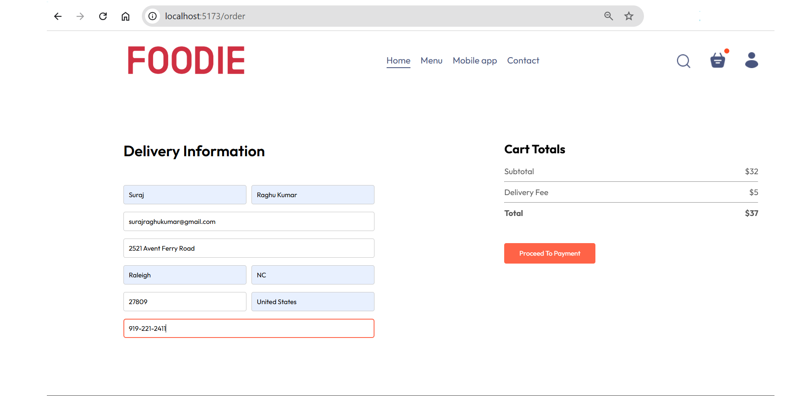

# 🍽️ Foodie – MERN (MongoDB, Express.js, React.js, and Node.js) Stack Food Delivery Web Application

## About
Foodie is a complete full-stack food delivery web application built using the MERN stack — MongoDB, Express.js, React.js, and Node.js. The platform is divided into three modules: a user-facing frontend, an admin dashboard, and a backend API server. Together, these components offer an efficient and responsive system for users to browse food items, manage orders, and for administrators to handle content and track activity.

## Features
### Customer Interface (Frontend - React.js, Vite, CSS)
- **Responsive Design:** Built with React and Vite, ensuring a fast and fluid user experience across desktops, tablets, and mobiles.
- **User Authentication:** Secure login and registration via JSON Web Tokens (JWT), with token-based route protection.
- **Menu Browsing:** Customers can browse food items by category, view descriptions, prices, and add items to their cart as shown in the figure 1 below.
- **Smart Cart System:** Cart is managed per-user with quantity tracking using MongoDB.
- **Order Placement:** Users can place orders, enter delivery details, and view totals including delivery fees as shown in figure 2 below.
  

<strong><small>Figure 1: Browse by Category </small></strong>
 

   

<strong><small>Figure 2: Cart and Checkout </small></strong>
 

   

