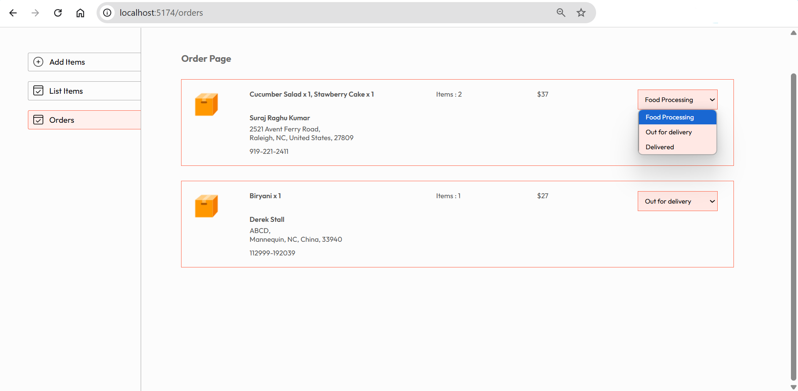

# 🍽️ Foodie – MERN (MongoDB, Express.js, React.js, and Node.js) Stack Food Delivery Web Application


## About
Foodie is a complete full-stack food delivery web application built using the MERN stack — MongoDB, Express.js, React.js, and Node.js. The platform is divided into three modules: a user-facing frontend, an admin dashboard, and a backend API server. Together, these components offer an efficient and responsive system for users to browse food items, manage orders, and for administrators to handle content and track activity.

## Features
### Customer Interface (Frontend - React.js, Vite, CSS)
- **Responsive Design:** Built with React and Vite, ensuring a fast and fluid user experience across desktops, tablets, and mobiles.
- **User Authentication:** Secure login and registration via JSON Web Tokens (JWT), with token-based route protection.
- **Menu Browsing:** Customers can browse food items by category, view descriptions, prices, and add items to their cart as shown in the figure 1 below.
- **Smart Cart System:** Cart is managed per-user with quantity tracking using MongoDB.
- **Order Placement:** Users can place orders, enter delivery details, and view totals including delivery fees as shown in figure 2 below.
  
<p align=""><strong><small>Figure 1: Browse by Category </small></strong></p> 

   


<p align=""><strong><small>Figure 2: Cart and Checkout </small></strong></p> 

   


### Admin Interface (Frontend - React.js, Vite, CSS)
- **Food Catalog Management:** Add, edit, and delete food items including name, description, category, and images as shown in the Figure 3 below.
- **Order Monitoring:** Track all orders placed across the platform and update their statuses (e.g., "Processing", "Delivered") as shown in the Figure 4 below.
  
<p align=""><strong><small>Figure 3: Food Catalog Management </small></strong></p> 


<p align=""><strong><small>Figure 4: Order Status Monitoring </small></strong></p> 



### Backend API (Express.js)
- **RESTful Architecture:** Built using Express.js to manage authentication, cart, order, and product operations.
- **JWT(JSON Web Token) Middleware:** Protects sensitive endpoints by verifying tokens and attaching user data to requests.
- **Mongoose Models:** Developed schema definitions for User, Order, and Food, enabling efficient CRUD operations on MongoDB.
- **Modular Controllers:** Separated logic for users, cart, food, and orders to maintain code clarity and scalability.

### Project Execution Steps
####  1. Setup Backend
- **Step 1:** Clone the Repository.
- **Step 2:** Set Up Backend
```bash
cd foodie/backend
npm install
```
- **Step 3:** Your can either update the existing .env file with your PORT number, MONGO_URI and JWT_SECRET_KEY or leave it as it is.
- **Step 4:** Start the backend server
```bash
npm start
```
#### 2. Setup Frontend
```bash
cd foodie/frontend
npm install
npm run dev
```
#### 3. Setup Admin Panel
```bash
cd foodie/admin
npm install
npm run dev
```
### Future Enhancements
- Pagination and filtering for large food menus
- Push/email notifications on order events
- Increase scope of Role-based access control (e.g. separate delivery personnel login)

  
